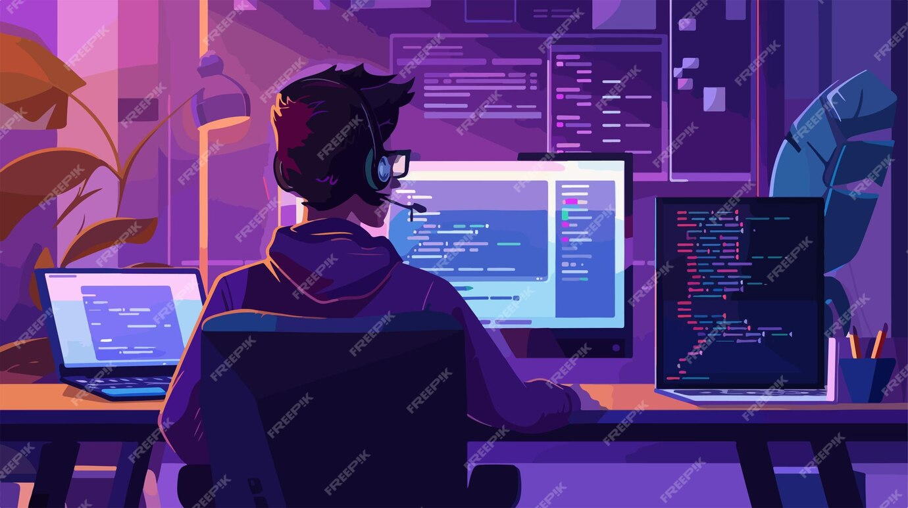

<h1 align="center">Hi 👋, I'm Venkata Dinesh Puranam</h1>
<h3 align="center">Conversational AI & GenAI Engineer from India</h3>

<strong>RAG · Enterprise AI · Python · Azure AI</strong> Forward Deployed Engineer — EY GDS Trained

  <a href="https://www.linkedin.com/in/dineshpuranam/">LinkedIn</a> &nbsp;•&nbsp;
  <a href="mailto:dineshpuranam90@gmail.com">Email</a> &nbsp;•&nbsp;
  <a href="https://github.com/VenkataDineshPuranam?tab=repositories">Explore my projects</a>

---

### 👨‍💻 About me

I bring **9+ years across conversational AI, NLP, enterprise AI and data operations**. My strongest areas are **Conversational AI, RAG and enterprise integrations**, with growing hands-on experience in agentic workflows.

- 🔭 **Currently working on:** enterprise RAG, conversational AI, LLM evaluation, observability and secure AI services.
- 🛠️ **Experience includes:** Genesys Cloud, Kore.ai, Agent Copilot, summarization, knowledge search and multilingual AI evaluation.
- 🌱 **Currently exploring:** LangGraph orchestration, tool use and human-in-the-loop workflows.
- 👯 **Open to collaborating on:** RAG applications, conversational AI and evaluation tooling.
- 💬 **Ask me about:** LLMs, prompt engineering, conversational AI and RAG evaluation.
- 📍 **Based in:** Hyderabad, India — open to relocation to Abu Dhabi / UAE.
- 📫 **Reach me:** [dineshpuranam90@gmail.com](mailto:dineshpuranam90@gmail.com)

 

### 🚀 Featured projects

A selection of my capstone, independent projects and hands-on labs. Project READMEs describe setup, scope and limitations.

| Project | What you can explore |
| :--- | :--- |
| 🧬 **[AEGIS Pharma Control Center](https://github.com/VenkataDineshPuranam/Team3_AEGIS_Pharma_Capstone_AgenticV3)** | Team FDE capstone with six LangGraph workflows, a Next.js interface, human approvals, access controls and evaluation. Uses synthetic pharmaceutical scenarios. |
| 🗓️ **[AI Project & Product Planner](https://github.com/VenkataDineshPuranam/ai-project-product-planner)** | Scheduling, dependencies, AI lifecycle tracking and governance. Offline-capable prototype; current UI persistence limitations are documented. |
| ☁️ **[Azure Deployment & LLMOps Lab](https://github.com/VenkataDineshPuranam/azure-ai-labs-10abcde)** | FastAPI, Docker, Azure Container Apps, CI/CD evaluation gates, autoscaling exercises and rollback drills. |
| 📚 **[Document RAG Q&A](https://github.com/VenkataDineshPuranam/RAG-document-Q-A-Chatbot)** | PDF question answering with Groq, OpenAI embeddings, FAISS and Streamlit. |
| 💬 **[Conversational Q&A with Chat History](https://github.com/VenkataDineshPuranam/Conversational-Q-A_with-chat-history)** | Document conversations with follow-up context, source references and chat history. |
| ✍️ **[Text Summarization with LangChain](https://github.com/VenkataDineshPuranam/Text-summarization-using-Langchain)** | Multilingual summarization experiments using stuff, map-reduce and refine approaches. |

### 🧰 Languages and tools

| Area | Technologies and skills |
| :--- | :--- |
| **Programming & APIs** | Python · FastAPI · Pydantic · SQL · REST APIs |
| **Conversational AI** | Genesys Cloud · Kore.ai · NLP · IVR · Chatbots |
| **GenAI & retrieval** | RAG · LangChain · LangGraph · Hybrid search · Reranking · Prompt engineering |
| **Cloud & deployment** | Azure AI Foundry · Azure AI Search · Azure Container Apps · AWS Bedrock · Docker |
| **Evaluation & observability** | RAGAS · DeepEval · LangSmith · Jenkins · Model monitoring |
| **Data & development** | Pandas · NumPy · Matplotlib · Git · Streamlit |
| **Security & governance** | RBAC · JWT authentication · Entitlement services · PII controls · Audit logging |
| **AI coding tools** | Claude Code · Cursor · OpenCode · Codex · GitHub Copilot |

### 🎓 Certifications and training

- **EY Forward Deployed Engineer (FDE) Program — Trained**
- **Microsoft AI-102:** Azure AI Engineer Associate · **AI-900:** Azure AI Fundamentals
- **Microsoft Hackathon:** Agentic AI Proficient Developer
- **Hugging Face:** AI Agents Fundamentals · **Kore.ai:** XO11 Basic Automation

---

Interested in building practical, evaluated AI applications? <a href="https://www.linkedin.com/in/dineshpuranam/">Let's connect on LinkedIn</a> · <a href="mailto:dineshpuranam90@gmail.com">Get in touch</a>

